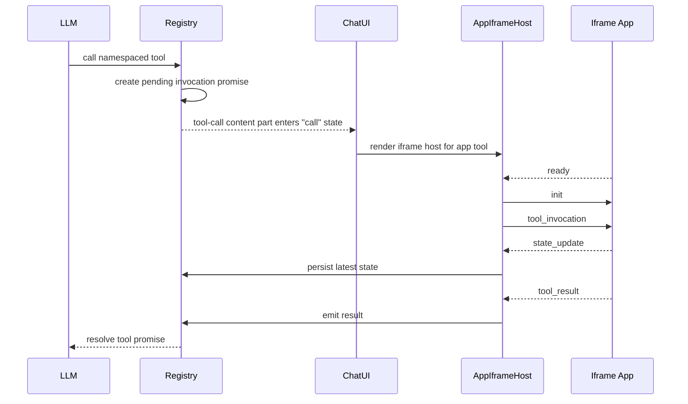

# App Registry Guide

## Purpose

This guide explains how the ChatBridge platform-side app registry works.

Use it when you need to:

- register a new app manifest on the platform side
- expose app tools to the LLM
- understand how iframe-backed tools resolve through the registry
- understand how app state is persisted into session context

For the full app-side contract, read `docs/APP_REQUIREMENTS.md`.

## Files

The platform registry lives in these files:

- `src/shared/types/app-manifest.ts`
- `src/renderer/packages/app-registry/index.ts`
- `src/renderer/packages/app-registry/event-bus.ts`
- `src/renderer/packages/app-registry/state.ts`
- `src/renderer/packages/app-registry/manifests/index.ts`
- `src/renderer/components/app/AppIframeHost.tsx`
- `src/renderer/components/message-parts/AppToolCallUI.tsx`

## Manifest Format

Each app is registered through an `AppManifest`.

```ts
type AppManifest = {
  id: string
  name: string
  version: string
  description: string
  type: 'internal' | 'external_public' | 'external_authenticated'
  url: string
  icon?: string
  tools: ToolDefinition[]
  auth?: {
    type: 'oauth2'
    authorizationUrl: string
    tokenUrl: string
    scopes: string[]
  }
  permissions: string[]
  completionSignals: string[]
}

type ToolDefinition = {
  name: string
  description: string
  parameters: Record<string, unknown>
  returns: Record<string, unknown>
  uiTrigger: boolean
  timeoutMs?: number
}
```

Key rules:

- `id` must be unique.
- Tool names in the manifest are unqualified.
- The registry namespaces tools as `{appId}.{toolName}` before exposing them to the LLM.
- `parameters` should be JSON Schema compatible with the subset supported by the registry bridge.
- `uiTrigger: true` means the tool should render the iframe UI inline in chat.

## Registering An App

1. Add a manifest object under `src/renderer/packages/app-registry/manifests/`.
2. Export it from `src/renderer/packages/app-registry/manifests/index.ts`.
3. Ensure the manifest passes `AppManifestSchema`.
4. Make sure the app itself follows `docs/APP_REQUIREMENTS.md`.

The registry bootstraps `defaultApps` on import, so exported manifests become available automatically.

## How Tools Reach The LLM

`stream-text.ts` merges app tools into the normal `ToolSet` only for web builds:

- MCP tools are added first
- app tools are added next
- web, knowledge-base, and file tools are added afterward

Each app tool is wrapped with the Vercel AI SDK `tool()` helper. The wrapper:

- converts the manifest's JSON-schema-like `parameters` into a Zod input schema
- creates a pending invocation promise
- emits an `invoke` event on the app event bus
- waits for the iframe host to emit `result` or `error`

This preserves the existing multi-step tool loop in the model pipeline.

## Runtime Flow



## postMessage Protocol

The platform host currently handles these inbound app messages:

- `ready`
- `pong`
- `state_update`
- `tool_result`
- `completion`
- `error`

The platform sends these outbound messages:

- `init`
- `tool_invocation`
- `ping`

Important behavior:

- the parent uses the registered app origin as `targetOrigin`
- the host verifies `event.source` and origin before accepting messages
- tool invocations time out after `timeoutMs` or 30 seconds by default
- a missed heartbeat marks the app as failed

## State Persistence

App state snapshots are stored as tagged `system` messages inside the session:

```text
<CHATBRIDGE_APP_STATE>{"appId":"...","savedAt":123,"state":{...}}</CHATBRIDGE_APP_STATE>
```

This gives the platform three useful properties:

- the latest app state can be reloaded into the iframe on future mounts
- the state travels with the session's normal persistence path
- the model can receive the serialized state through the existing message conversion pipeline

`state.ts` exposes:

- `persistAppState(sessionId, appId, state)`
- `getLastAppState(sessionId, appId)`
- `formatAppStateForContext(appId, state)`

## Local Testing

During local development, a manifest URL may point to `http://localhost:<port>`.

Recommended workflow:

1. Build or run the target app separately.
2. Point the manifest `url` at the local app.
3. Use a manifest description that clearly says the tool is for development if it should not be used in normal conversations.
4. Trigger the tool through the chat and verify:
   - the iframe loads
   - `ready` is received
   - `tool_result` resolves the pending tool call
   - `state_update` persists state
   - reload and fullscreen remounts rehydrate from persisted state

## Current Placeholder App

The registry currently includes a development-only echo manifest in `src/renderer/packages/app-registry/manifests/index.ts`.

Its purpose is only to validate the platform plumbing. Replace it or remove it when real app manifests are ready.
