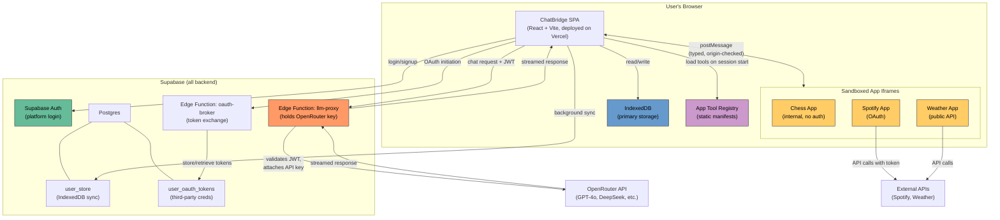
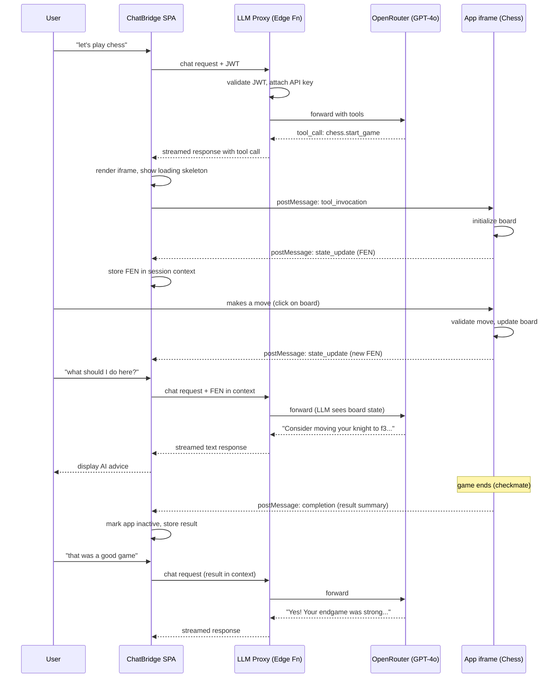
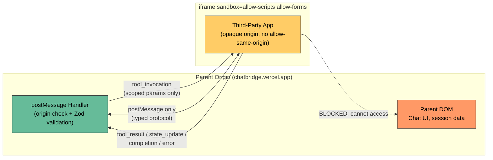
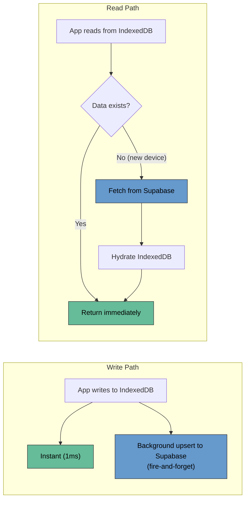

# Architecture Review - Presentation Notes

**Time budget: ~3 min presenting, ~2 min Q&A**

---

## Opening (15 sec)

Building ChatBridge on top of Chatbox Community Edition. Chatbox is an Electron desktop app for chatting with LLMs. We are deploying the web build to a public URL and turning it into a platform where third-party apps run inside conversations.

---

## The Core Problem (30 sec)

The base repo looks like it already solves most of this. It has a plugin system, an iframe renderer, tool calling with multiple LLM providers, and persistent chat. After digging into the code, three things that look reusable actually are not:

- **MCP (the plugin system)** is gated behind `platform.type === 'desktop'` in feature flags. It does not run in the web build.
- **Artifact.tsx (the iframe renderer)** uses `targetOrigin='*'`, has no message protocol, no lifecycle events. It is an HTML preview widget, not an app host.
- **API keys are stored client-side** in user settings. Fine for a local BYOK desktop app. Not acceptable for a shared deployed platform where we provide the key.

So the real work is replacing these three things, not extending them.

---

## Architecture Overview (60 sec)

**Four components, one vendor for backend:**

```
Browser (Vercel static SPA)
  ├── React app (existing Chatbox web build)
  ├── IndexedDB (primary storage, local-first)
  ├── Custom App Tool Registry (replaces MCP)
  └── App iframes (sandboxed, cross-origin)

Supabase (all backend needs)
  ├── Auth (platform login)
  ├── Edge Function: llm-proxy (holds OpenRouter key, forwards requests)
  ├── Edge Function: oauth-broker (third-party token exchange)
  ├── user_store table (IndexedDB cloud sync)
  └── user_oauth_tokens table (third-party credentials)
```

- LLM calls go: browser → Edge Function (validates JWT, attaches API key) → OpenRouter → streamed back
- App communication: typed postMessage between parent and iframes
- Three apps: Chess (internal, stateful), Weather (public API, stateless), Spotify or GitHub (OAuth, authenticated)

---

## Key Decisions and Why (90 sec)

**1. LLM key behind a server-side proxy, not client-side**

- Chatbox assumes users enter their own API keys. We provide the key for a shared platform.
- If the key is in the browser bundle or in settings, anyone can extract it from DevTools.
- The Edge Function holds it as an env var, validates the user's auth token before every request.
- Trade-off: adds ~50-100ms latency per LLM call. Acceptable for chat.

**2. Custom tool registry instead of MCP**

- MCP is the obvious choice since Chatbox already has a full client implementation.
- It is desktop-only. The feature flag check is hard-coded. We cannot use it in the web build.
- We build a simpler registry: static TypeScript manifests defining tools with JSON schemas, loaded at session start, merged into the same `ToolSet` merge point in `stream-text.ts` where MCP tools would go.
- Trade-off: we lose MCP's dynamic discovery and transport layer. We do not need it since our three apps are known at build time.

**3. iframe without `allow-same-origin`**

- Omitting `allow-same-origin` from the sandbox is the only way to truly prevent an app from accessing the parent DOM.
- Trade-off: the app runs in an opaque origin, which means it cannot use cookies or same-origin storage normally. Apps must be self-contained.
- We accept this because our apps are separate Vercel deployments with their own origins anyway.

**4. Local-first persistence with cloud sync**

- Chatbox already uses IndexedDB for the web build. It works. Chat is fast.
- Problem: if you add user auth but keep data browser-local, logging in on a new device shows empty history.
- Solution: IndexedDB stays primary (fast reads, no migration). A `SupabaseBackedStorage` adapter syncs writes to Supabase in the background. New device hydrates from Supabase on first visit.
- Trade-off: last-write-wins conflict resolution. No real-time sync. Acceptable for a demo where simultaneous multi-device editing will not be tested.

**5. Static allow-list, not an open app marketplace**

- We build all three apps. The registry is a TypeScript config shipped with the build.
- The same-origin policy makes cross-origin iframes opaque: the parent cannot inspect what an app renders. Content verification at runtime is impossible.
- We cannot solve marketplace trust in a week, so we do not pretend to. The architecture has an insertion point for a review gate later.

---

## Known Weaknesses (15 sec)

- No conflict resolution for multi-device sync. Last write wins.
- Edge Function cold starts add latency on first request (~200ms).
- If the Edge Function goes down, chat stops working (single point of failure for LLM calls).
- The web build has not been tested yet. `pnpm dev:web` might have issues. This is Day 1 priority.

---

## Closing (10 sec)

The interesting parts of this project are not the chat (that already works) or the UI (Chatbox has that). The interesting parts are the app lifecycle protocol, the security boundary, and making the key storage work for a deployed platform. That is where the sprint time goes.

---

---

# Anticipated Questions and Answers

### "Why Supabase instead of rolling your own backend?"

One-week sprint, solo developer. Supabase gives me auth, a database, and serverless functions in one service on a free tier. Building an Express server with JWT auth, Postgres connection, and deployment config would take a full day that is better spent on the plugin system. Auth is not the differentiator here.

### "What happens if the LLM proxy Edge Function goes down?"

Chat stops working. It is a single point of failure. Mitigation: Supabase Edge Functions run on Deno Deploy, which is distributed and has high uptime. For a demo-scale project this is an acceptable risk. In production you would add a fallback provider or allow temporary BYOK mode.

### "Why not just do BYOK and skip the proxy entirely?"

The assignment says "deployed application" and graders will test it. Asking a grader to paste in an API key before they can use the app is a bad experience and may not be acceptable. The proxy means the grader visits the URL, logs in, and everything works.

### "Can a malicious app exfiltrate data you pass to it via tool invocations?"

Yes. The sandbox prevents the app from reaching the parent DOM, but it cannot block outbound fetch requests from within the iframe. The mitigation is that apps only receive the parameters explicitly defined in their tool schema (principle of least privilege). A chess app gets a FEN string and a move, not the chat history or other apps' tokens. For production, gated review before listing is the real answer.

### "Why not use Web Components instead of iframes?"

Web Components run in the same origin as the parent. A malicious component can access `document`, `localStorage`, cookies, the full DOM. There is no security boundary. They are fine for first-party UI elements but not for third-party untrusted apps.

### "How do you handle the case where an app never sends a completion signal?"

Timeout. Each tool invocation has a 30-second default timeout (configurable per app). If the app does not respond, the platform cancels the invocation, sends an error to the LLM, and the LLM tells the user what happened. A heartbeat (ping/pong every 10 seconds) detects crashed iframes separately.

### "What if the chess app state gets out of sync between the iframe and the LLM context?"

The app is the source of truth for its own state. Every time the board changes, the app sends a `state_update` with the current FEN string. The platform stores the latest one. If the LLM's context has a stale FEN (because a state_update was missed), the worst case is the AI gives advice based on a position that is one move behind. On the next turn it catches up.

### "How does OAuth work if you can't do redirects inside an iframe?"

We do not. OAuth happens in a popup window (`window.open()`). The user clicks "Connect Spotify" in the chat, a popup opens to the Edge Function's OAuth initiation endpoint, the user consents on Spotify, the callback hits the Edge Function which stores the tokens server-side, the popup closes, and the parent window retries the tool invocation with the new credentials.

### "What if IndexedDB gets cleared but Supabase still has the data?"

That is the point of the sync. On next login, IndexedDB is empty, so the storage adapter falls through to Supabase and rehydrates the local store. The user sees a brief loading spinner on that first visit, then everything is instant again.

### "You said MCP is desktop-only. Could you just remove the feature flag check?"

Technically the flag is one line of code. But MCP's transports (stdio, HTTP/SSE) expect a server process. In the web build there is no Node process to spawn or local server to connect to. The transport layer itself does not work in a browser, not just the flag. That is why we build a custom registry that works with static manifests and postMessage instead.

### "How do you know which app to route a tool call to?"

Tools are namespaced by app ID: `chess.start_game`, `weather.get_current`, `spotify.search_tracks`. The LLM sees these names and descriptions in its function-calling context and picks the right one. If the user asks something ambiguous, the LLM can ask for clarification or pick the most likely match based on the tool descriptions. Testing scenario 6 specifically tests this.

### "What is your cost estimate for the demo?"

Development is $0 (free DeepSeek models on OpenRouter). The demo and grading period using GPT-4o through OpenRouter should cost $5-15 total based on typical usage. Infrastructure is $0 (Supabase free tier, Vercel free tier). The Edge Functions have a 500K invocation/month free allowance.

---

---

# Architecture Diagram (Mermaid)

Use this as the visual for the video walkthrough. Render in any Mermaid-compatible tool (mermaid.live, VS Code Mermaid preview extension, or GitHub/GitLab markdown preview).

## Full System Architecture



## App Lifecycle (Tool Invocation Flow)



## Security Boundary



## Data Flow and Storage


